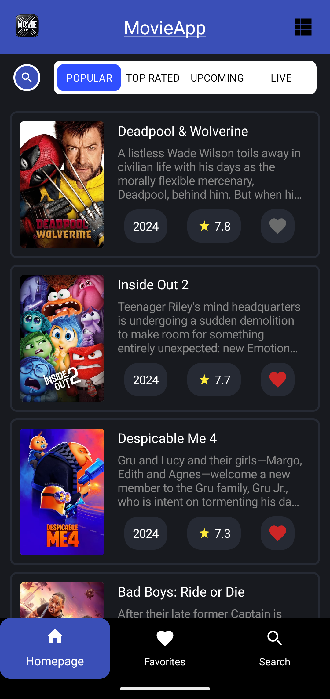
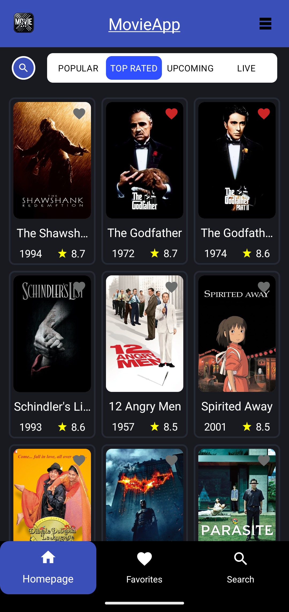
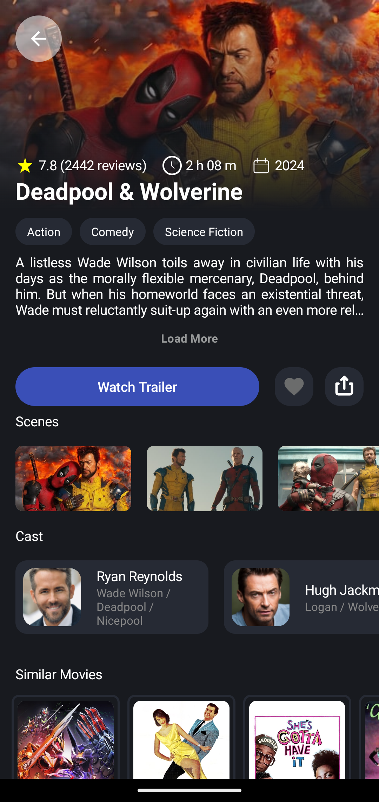
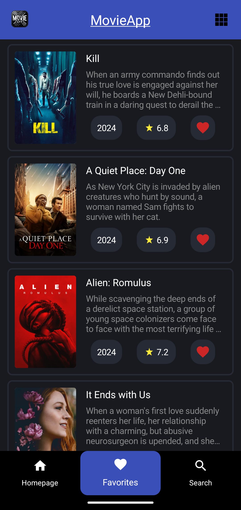
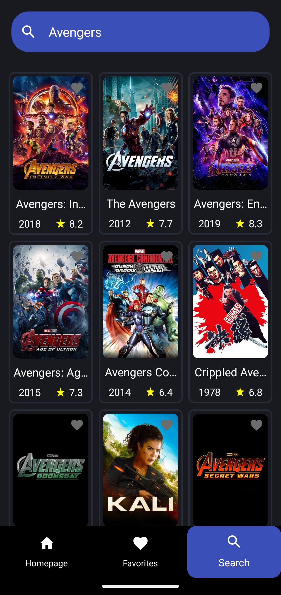

# MovieApp 🎬

**MovieApp** is a mobile application developed for the Android platform using the Kotlin programming language. This application provides users with information about popular, top-rated, currently showing, and upcoming movies. Users can search for movies, view movie details, and add movies to their favorites list.

## Features 📱

- **Movie Search**: Users can search for movies using keywords.
- **Popular Movies**: Lists currently popular movies.
- **Top Rated Movies**: Shows movies with the highest ratings.
- **Now Playing Movies**: Lists movies that are currently in theaters.
- **Upcoming Movies**: Displays movies that are about to be released.
- **Movie Details**: Provides detailed information and an option to watch trailers for each movie.
- **Add to Favorites**: Users can save their favorite movies.

## Screenshots 📸

<div style="display: flex; flex-direction: row; justify-content: space-around;">
    
    
    
    
    
</div>

## Installation and Usage 🛠️

### Requirements

- Android Studio Arctic Fox or newer
- Minimum API level: 24 (Android 7.0 Nougat)

### Installation

1. Clone this repository:
    ```bash
    git clone https://github.com/berkkanrencber/MovieApp.git
    ```
2. Open Android Studio and import the project folder.
3. Sync the project to ensure all dependencies are installed.
4. Connect an Android device or emulator and run the application.

## Technologies and Libraries Used 🛠️

- **Kotlin**: Programming language for the application.
- **Jetpack Compose**: For modern UI design and implementation.
- **MVVM Architecture**: Model-View-ViewModel structure as the application architecture.
- **Coroutines**: Kotlin Coroutines for asynchronous tasks and background operations.
- **Dagger-Hilt**: For Dependency Injection.
- **Retrofit**: For REST API calls.
- **Room**: For local database management.
- **Coil**: For image loading.
- **Navigation Component**: For in-app navigation.

## Adding the API Key 🔑

To run the application, you need a movie API key. Please follow these steps:

1. Obtain an API key from [The Movie Database (TMDb)](https://www.themoviedb.org/).
2. Add `API_KEY=YOUR_API_KEY` to the `local.properties` file.

## Contact 📧

- **Developer**: [berkkanrencber](https://github.com/berkkanrencber)
- **Email**: berkkanrencber@gmail.com

I would be glad to hear your feedback and suggestions! 🎉
